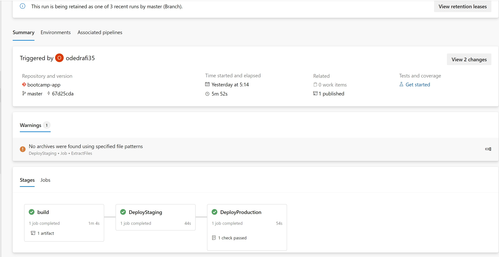
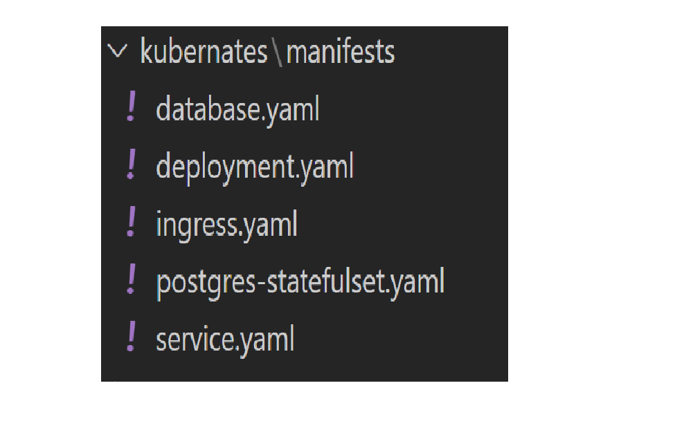

# Kubernates pipeline for nodejs app

# Description

Weight-tracker webapp deployied in azure devops.
a simple nodejs app with kubernates azure devops implimentation

> Kubernates pipeline (  "azure-k8s-pippeline.yaml")

For the infrastracture we will use the repo from [k8s terrafom infrastructure repo](https://github.com/odedrafi/K8sInfrastructure-week9-10-). apply the ifrastructure and start the process.

# Pipeline Agent  initialization

- update the server:
> sudo apt-get update

- Install docker with:
> sudo apt-get install -y docker.io

- Open acces to fockr run
>sudo chmod 666 /var/run/docker.

- Install kubectl with:

>sudo snap install kubectl --classic

- Install az  

>curl -sL https://aka.ms/InstallAzureCLIDeb | sudo bash

- Connect to your subscripyion by 

> az login

- Make sure to connect to your cluster by :

> az aks get-credentials --resource-group {your resource group name} --name {your azure kubernates cluster name} --overwrite-existing

- Connect your azure container repository to your aks 

> az aks update -n {your azure kubernates cluster name}  -g RG --attach-acr {your azure container registery name} 

- Run this script (red section is were to edit to your variables)  to connect your agent to azure devops pipline:

> mkdir azagent
cd azagent
curl -fkSL -o vstsagent.tar.gz https://vstsagentpackage.azureedge.net/agent/2.202.1/vsts-agent-linux-x64-2.202.1.tar.gz
tar -zxvf vstsagent.tar.gz
if [ -x "$(command -v systemctl)" ]; then
    ./config.sh --pool  {your pool name} --acceptteeeula --agent $HOSTNAME --url  {your azure devops project url} --work _work --projectname  {'your azure devops project name'} --auth PAT --token  {your azure devops pat token} --runasservice
    sudo ./svc.sh install
    sudo ./svc.sh start
else
    ./config.sh --pool  {your pool name} --acceptteeeula --agent $HOSTNAME --url  {your azure devops project url} --work _work --projectname  {'your azure devops project name'} --auth PAT --token  {your azure devops pat token}
    ./run.sh
fi

this project is part of bottcamp in sela[Sela DevOps Bootcamp Page](https://rhinops.io/bootcamp).

ci\cd illustration

## running the pipeline:

- This pipline uses files to deploy the k8s cluster with kubectl commmands using the .yaml file in the repo

  >sudo apt-get update 

  >apt-get upgrade -y

  >curl -fsSL https://get.docker.com/ -o get-docker.sh

  >bash get-docker.sh

  >sudo chmod 666 /var/run/docker.
  
  >sock (to make the container accesible)  
- Node.js 14.x 
- PostgreSQL (can be installed locally using Docker)
- Free Okta developer account for account registration, login
## Deployment

This project dosn't yet containe a ci\cd pipeline for infrastructureso it will have to be deployd manually.us
### Create an azure devops project:
##### deployment of universal packadge Pipeline:
In the azure devops UI we can intigrate everything we need for the project .

> here are the steps demonstrated in this pproject

- import your app repo to Azure Repo

- Go to Azure Pipelines tab and start a new pipeline using a multi staged yaml(not classic) file
- We will run a simple dependacies installation and archive our solution as an artifact and Publish it(save it) to Azure artifacts
  for that purpose we can use the command which is suited for ci testing :

  > $ [npm ci](https://docs.npmjs.com/cli/v8/commands/npm-ci)

##### deployment of the docker pipeline:

ENV file format:

---

### Demo

---

### expected resultes

Universal packadge pipeline.

Docker pipeline.

---

### Links for tips and intructions

- [how to install Ansible](https://gitlab.com/ansible-workshop/labs/lab06)
- infrastructure Used in this project deployed by terraform[Terraform repo](https://github.com/odedrafi/SelaBootcampWeek5Terraform.git)
- [Multi-stage yaml syntax example](https://docs.microsoft.com/en-us/azure/devops/pipelines/process/stages?view=azure-devops&tabs=yaml)

