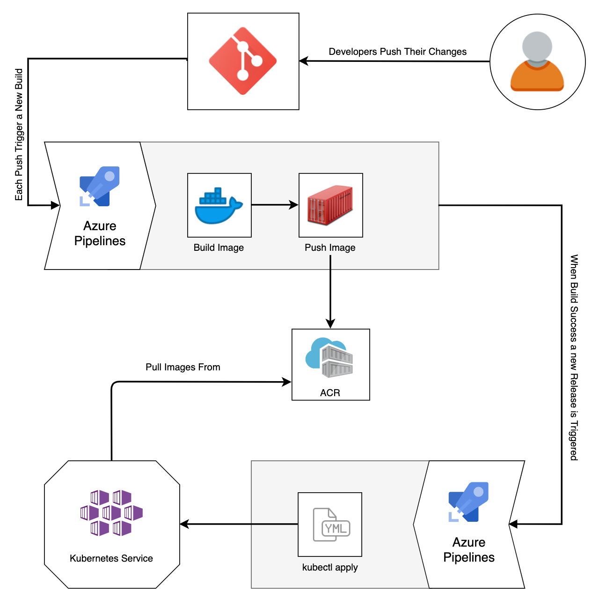

# Kubernates pipeline for nodejs app

# Description

Weight-tracker webapp deployied in azure devops.
a simple nodejs app with kubernates azure devops implimentation

> Kubernates pipeline (  "azure-k8s-pippeline.yaml")

For the infrastracture we will use the repo from [k8s terrafom infrastructure repo](https://github.com/odedrafi/K8sInfrastructure-week9-10-). apply the ifrastructure and start the process.

# Pipeline Agent  initialization

### After applying the environment we will need to configure our pipeline agent either maually, or by creating a script to run the following init commands:
(red section is were to edit to your variables)

- update the server:
> sudo apt-get update

- Install docker with:
> sudo apt-get install -y docker.io

- Open acces to dockr run
>sudo chmod 666 /var/run/docker.

- Install kubectl with:

>sudo snap install kubectl --classic

- Install az  

>curl -sL https://aka.ms/InstallAzureCLIDeb | sudo bash

- Connect to your subscripyion by 

> az login

- Make sure to connect to your cluster by :

> az aks get-credentials --resource-group {your resource group name} --name {your azure kubernates cluster name} --overwrite-existing

- Connect your azure container repository to your aks 

> az aks update -n {your azure kubernates cluster name}  -g RG --attach-acr {your azure container registery name} 

- Run this script to connect your agent to azure devops pipline:

mkdir azagent
cd azagent
curl -fkSL -o vstsagent.tar.gz https://vstsagentpackage.azureedge.net/agent/2.202.1/vsts-agent-linux-x64-2.202.1.tar.gz
tar -zxvf vstsagent.tar.gz
if [ -x "$(command -v systemctl)" ]; then
    ./config.sh --pool  {your pool name}  --acceptteeeula --agent $HOSTNAME --url  {your azure devops project url} --work _work --projectname  {'your azure devops project name'} --auth PAT --token  {your azure devops pat token} --runasservice
    sudo ./svc.sh install
    sudo ./svc.sh start
else
    ./config.sh --pool  {your pool name} --acceptteeeula --agent $HOSTNAME --url  {your azure devops project url} --work _work --projectname  {'your azure devops project name'} --auth PAT --token  {your azure devops pat token}
    ./run.sh
fi

---

this project is part of bottcamp in sela[Sela DevOps Bootcamp Page](https://rhinops.io/bootcamp).

ci\cd illustration

## running the pipeline:

- This pipline uses files to deploy the k8s cluster with kubectl commmands using the .yaml file in the repo

  >sudo apt-get update 

  >apt-get upgrade -y

  >curl -fsSL https://get.docker.com/ -o get-docker.sh

  >bash get-docker.sh

  >sudo chmod 666 /var/run/docker.
  
  >sock (to make the container accesible)  
- Node.js 14.x 
- PostgreSQL (can be installed locally using Docker)
- Free Okta developer account for account registration, login

##### deployment of k8s Pipeline:

>for this you will need to create a library in the azure dev ops project and with the vlues a secret inthe cluster will be created as part of the pipeline code.
according to env format

---

### Demo

---

### expected resultes

k8s pipeline.

---

### Links for tips and intructions

... readme not completed

